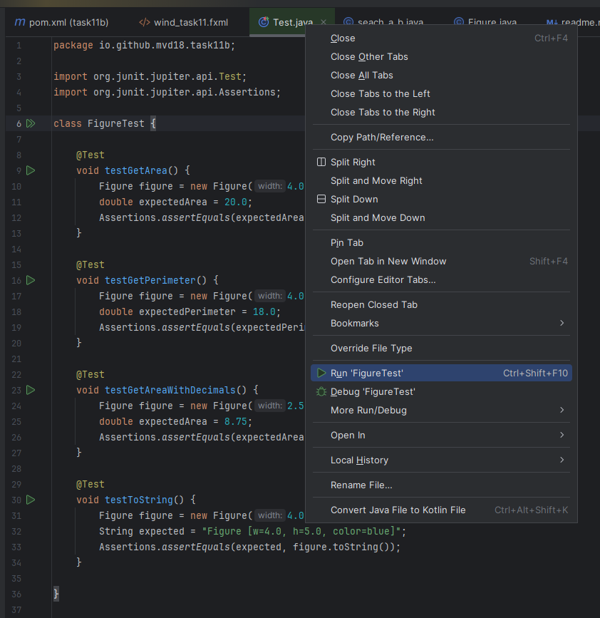
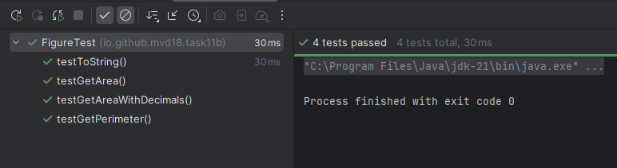
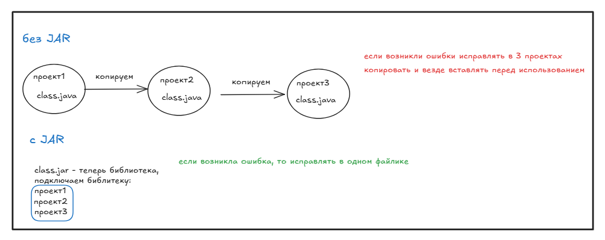
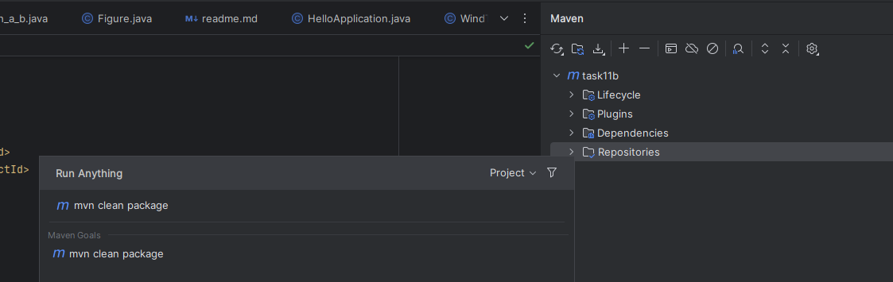
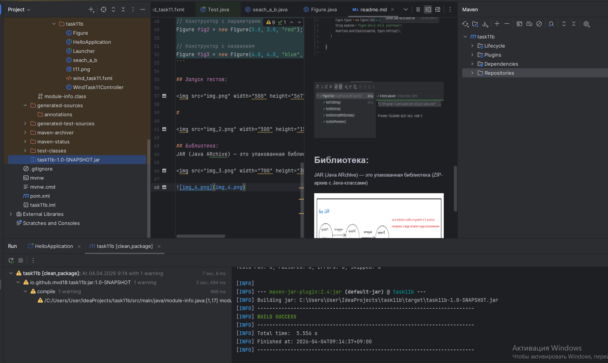
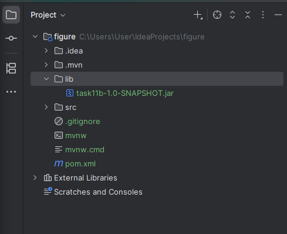
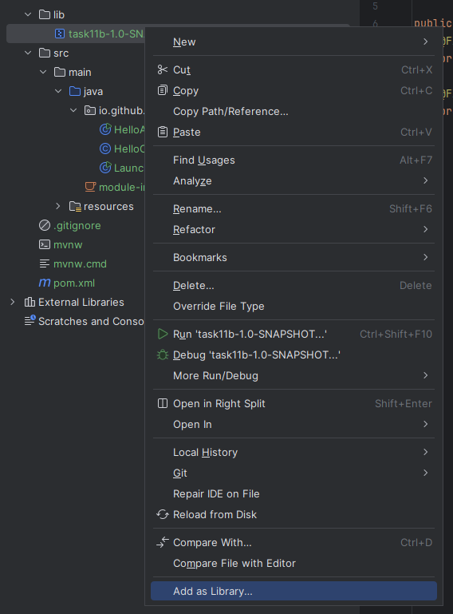
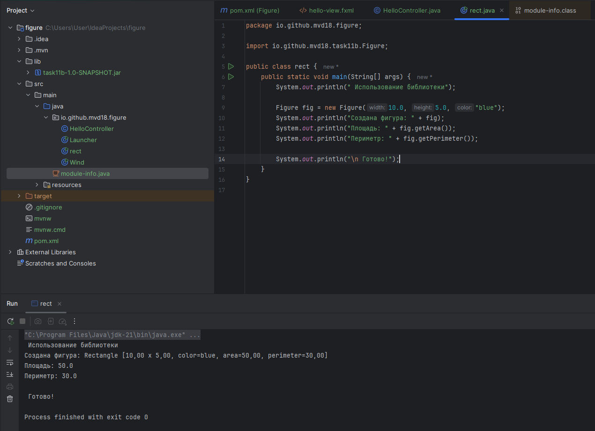
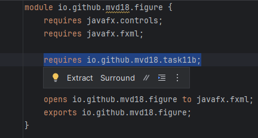

# Класс Figure - Геометрическая фигура (Прямоугольник)

## Назначение
Класс `Figure` представляет геометрическую фигуру - прямоугольник с возможностью:
- Хранения информации о размерах (ширина, высота)
- Хранения визуальных свойств (цвет, название)
- Вычисления основных характеристик (площадь, периметр)

## Методы 

Геттеры - методы доступа
```java
getHeight(); //Возвращает высоту фигуры double
getColor(); //Возвращает цвет фигуры String
getWidth();  //Возвращает ширину фигуры double
```

Сеттеры - методы изменения
```java
//Изменяет ширину фигуры
setWidth(double width); //параметр width — новая ширина (должна быть > 0)

//Изменяет высоту фигуры
setHeight(double height); // height — новая высота (должна быть > 0)

//Изменяет цвет фигуры
setColor(String color); //color — новый цвет
```

Методы поиска площади и периметра
```java
getArea(); //double — площадь width × height

getPerimeter(); //double — периметр 2 × (width + height)
```

```java
toString(); //возвращает строковое представление фигуры в формате: Figure [w=..., h=..., color=...]
```
## Пример использования

### Создание объекта

```java
// Конструктор по умолчанию
Figure fig1 = new Figure();

// Конструктор с параметрами
Figure fig2 = new Figure(5.0, 3.0, "red");

// Конструктор с названием
Figure fig3 = new Figure(4.0, 4.0, "blue", "Square");
```  

## Запуск тестов:



#



## Библиотека: 
JAR (Java ARchive) — это упакованная библиотека (ZIP-архив с Java-классами)



#



#



добавила библиотеку в новый проект




сделала библиотекой




запуск в другом проекте



проблемы до запуска 
1. не было строки в модуль инфо в новом проекте, эта строка отвечает за _подключение библиотеки к текущему проекту_

2. 
